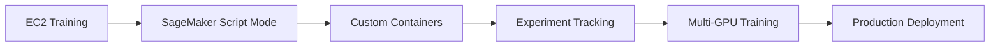

## The Challenge

Medical imaging generates massive amounts of data requiring specialized processing:

- **3D Volumes**: CT and MRI scans can be 512x512x300+ voxels
- **Large Models**: State-of-the-art architectures have 60M+ parameters
- **Long Training**: Single models can take days to train
- **Compliance**: HIPAA and data privacy requirements
- **Cost**: GPU resources are expensive

## Common Use Cases

### Image Classification
Categorize medical images into diagnostic classes:
- Chest X-ray pathology detection
- Skin lesion classification
- Retinal disease screening

### Image Segmentation
Identify and delineate anatomical structures:
- Tumor segmentation in MRI/CT
- Organ boundary detection
- Lesion measurement

### Object Detection
Locate abnormalities within images:
- Nodule detection in lung CT
- Fracture detection in X-rays

## Why AWS?

### Scalability
- On-demand GPU instances (ml.g5.xlarge to ml.g5.48xlarge)
- Multi-GPU distributed training
- Automatic scaling for inference

### Cost Optimization
- Spot instances (up to 70% savings)
- Warm pools (reduce startup time)
- Pay only for what you use

### Managed Services
- Amazon SageMaker for end-to-end ML
- Automatic infrastructure provisioning
- Built-in monitoring and logging

### Security & Compliance
- VPC isolation
- Encryption at rest and in transit
- HIPAA eligible services

## Workshop Journey

You'll progress from simple EC2 training to production-scale distributed training on SageMaker.
