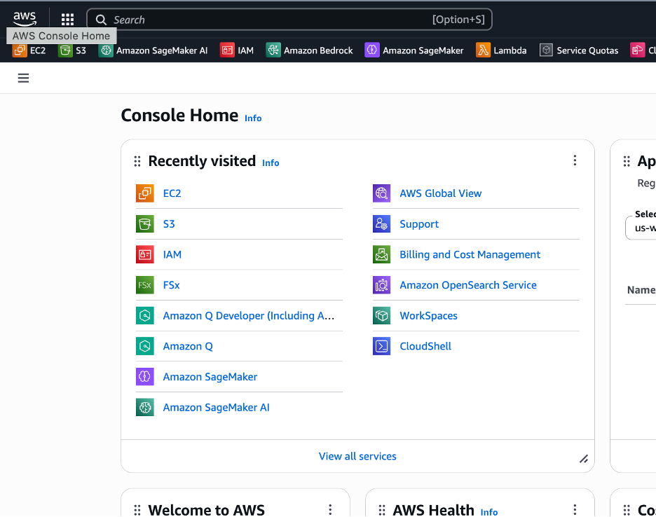
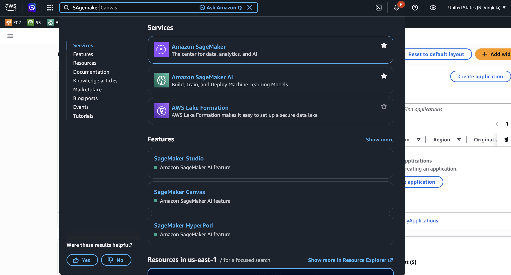
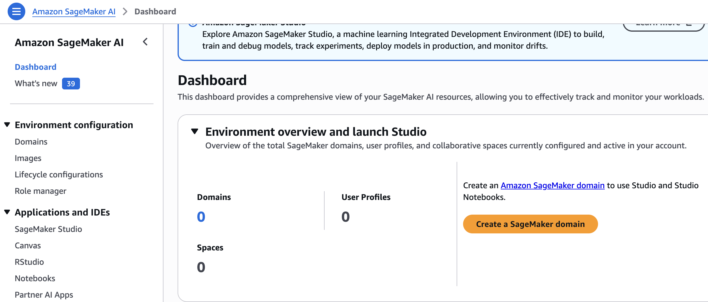
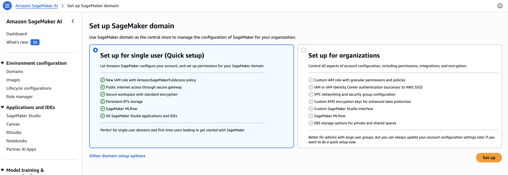
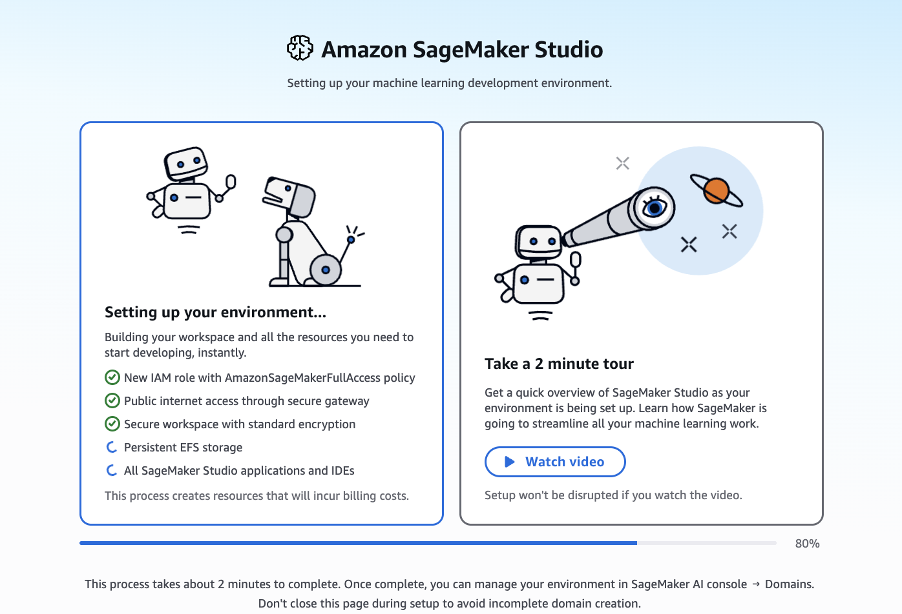
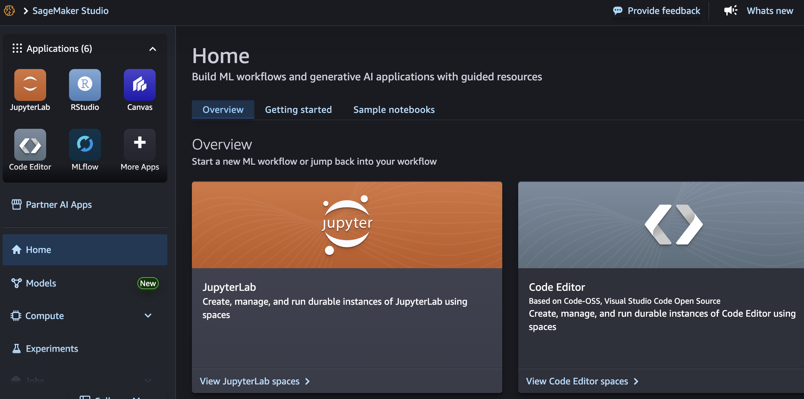
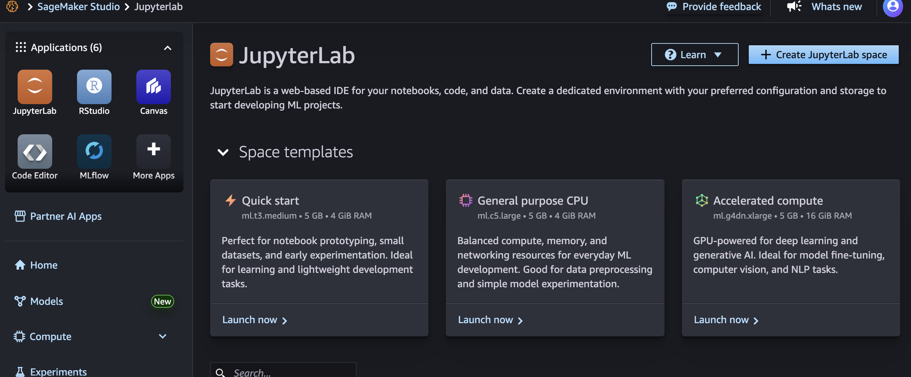
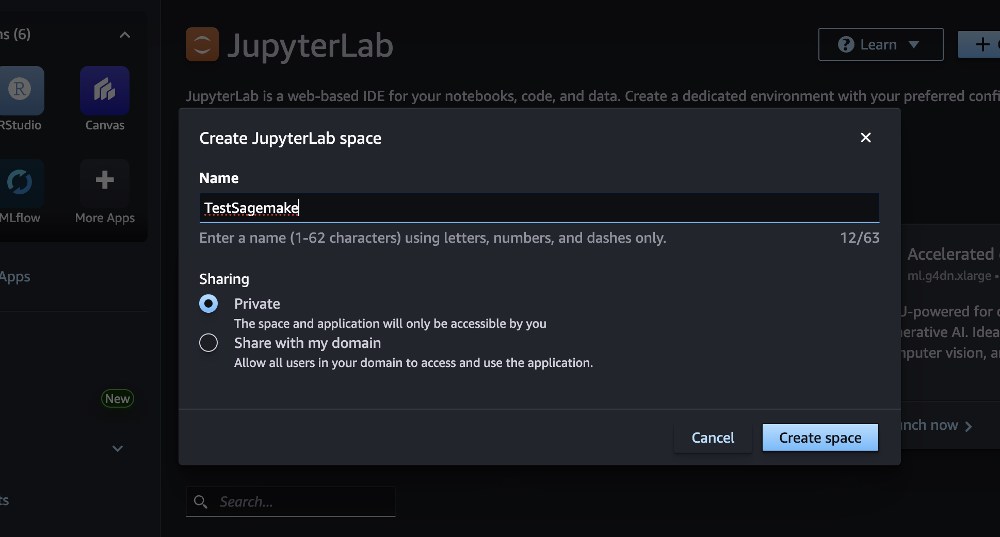
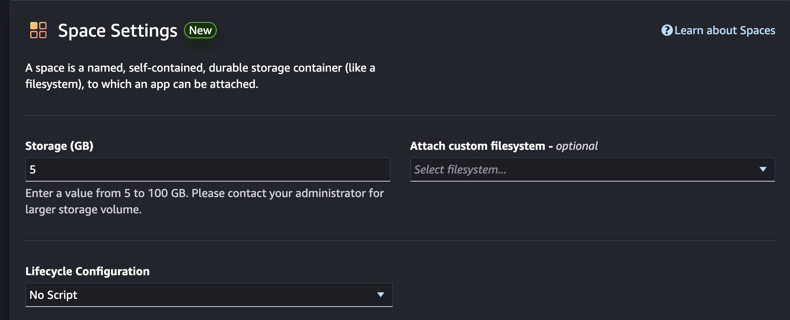

## Prerequisites Check

Before starting, ensure you have:

- ✅ AWS Account with appropriate access
- ✅ Basic Python and PyTorch knowledge
- ✅ Familiarity with Jupyter notebooks
- ✅ VS Code installed (optional, for local development)

## Workshop Infrastructure

This workshop can be run in two environments:

1. **SageMaker Studio** (Recommended) - Fully managed Jupyter environment
2. **EC2 with Deep Learning AMI** - For hands-on EC2 training modules

## Setup Option 1: SageMaker Studio (Recommended)

### 1. Access AWS Management Console

- Go to [AWS Console](https://console.aws.amazon.com/)
- Sign in with your credentials



### 2. Navigate to SageMaker

- Click on "Services" menu
- Search for "SageMaker AI"
- Select "Amazon SageMaker AI"
  


### 3. Create SageMaker Domain

If you don't have a domain yet:

- Click "Domains" in the left navigation
- Click "Create a Sagemaker domain"

- Choose "Quick setup" for faster deployment

- Select default VPC and subnet
- Click "Submit"
- Wait 5-10 minutes for domain creation


### 4. Launch JupyterLab

- Once domain is ready, you will be greeted with the following screen


- You will have a choice of different JupyterLab Spaces as shown here. You can choose a general purpose CPU based instance or an accelerated compute instance. You can also choose "Create JupyterLab Space"

- Name the JupyterLab Space and click on **Create Space**

- You will have a choice of instance 

- You can also choose the total size of the hard disk


### 5. Clone Workshop Repository

In Studio terminal:

```bash
git clone https://github.com/aws-samples/sample-migration-of-training-medical-imaging-modes-from-ec2-to-sagemaker.git
cd sample-migration-of-training-medical-imaging-modes-from-ec2-to-sagemaker
```

### 6. Configure IAM Role

SageMaker Studio automatically creates an execution role. Verify it has:

- `AmazonSageMakerFullAccess`
- `AmazonS3FullAccess`
- `AmazonEC2ContainerRegistryFullAccess`

To check:
1. Go to IAM console
2. Find role: `AmazonSageMaker-ExecutionRole-*`
3. Verify attached policies

### 7. Create S3 Bucket

```bash
# Set your region
export AWS_REGION=$(aws configure get region || echo "us-east-1")

# Create bucket with unique name
export WORKSHOP_BUCKET=medical-imaging-workshop-$(aws sts get-caller-identity --query Account --output text)-${AWS_REGION}

aws s3 mb s3://${WORKSHOP_BUCKET} --region ${AWS_REGION}
```

### 8. Install Dependencies

```bash
pip install -r requirements.txt
```

Required packages:
- `sagemaker>=2.200.0`
- `torch==2.4.1`
- `monai==1.3.2`
- `mlflow==3.0.0`
- `wandb`

## Setup Option 2: EC2 with Deep Learning AMI

### 1. Launch EC2 Instance

- Go to EC2 console
- Click "Launch Instance"
- **Name**: `medical-imaging-workshop`
- **AMI**: Search "Deep Learning" → Select "Deep Learning AMI GPU PyTorch"
- **Instance Type**: `g4dn.xlarge` (1 GPU) or `g4dn.2xlarge` (1 GPU, more memory)
- **Key Pair**: Create new `.pem` file and save securely

### 2. Configure Instance

- **Storage**: 100 GB GP3 (default 8 GB is insufficient)
- **Security Group**: Allow SSH (port 22) from your IP
- Click "Launch Instance"

### 3. Connect to Instance

Wait 2-3 minutes, then connect:

```bash
# Make key file secure
chmod 400 your-key.pem

# Connect via SSH
ssh -i your-key.pem ubuntu@<instance-public-ip>
```

Get public IP from EC2 console → Instance details.

### 4. Attach EBS Volume (Optional - For Persistent Storage)

If you need additional persistent storage:

**Create Volume:**
1. EC2 console → Volumes → Create Volume
2. Size: 100 GB
3. **Availability Zone**: Match your EC2 instance (e.g., `us-west-2a`)
4. Click "Create Volume"

**Attach Volume:**
1. Select volume → Actions → Attach Volume
2. Select your instance
3. Device name: `/dev/xvdbb`
4. Click "Attach"

**Mount Volume:**
```bash
# Format volume (first time only)
sudo mkfs -t ext4 /dev/nvme1n1

# Create mount point
mkdir ~/data

# Mount volume
sudo mount /dev/nvme1n1 ~/data
```

### 5. Configure IAM Role for EC2

**Create IAM Role:**
1. IAM console → Roles → Create Role
2. Select "AWS Service" → "EC2"
3. Attach policies:
   - `AmazonS3FullAccess`
   - `AmazonSageMakerFullAccess`
4. Name: `EC2-MedicalImaging-Role`
5. Create role

**Attach Role to EC2:**
1. EC2 console → Select instance
2. Actions → Security → Modify IAM Role
3. Select `EC2-MedicalImaging-Role`
4. Click "Update IAM Role"

### 6. Clone Repository on EC2

```bash
git clone https://github.com/aws-samples/sample-migration-of-training-medical-imaging-modes-from-ec2-to-sagemaker.git
cd sample-migration-of-training-medical-imaging-modes-from-ec2-to-sagemaker
```

### 7. Connect via VS Code (Optional)

**Install Remote-SSH Extension:**
1. Open VS Code
2. Install "Remote - SSH" extension

**Configure SSH:**
1. Click remote icon (bottom-left)
2. "Connect to Host" → "Configure SSH Hosts"
3. Edit `~/.ssh/config`:

```
Host medical-imaging-ec2
    HostName <ec2-public-ip>
    User ubuntu
    IdentityFile ~/path/to/your-key.pem
```

4. Connect to Host → Select `medical-imaging-ec2`

**Note**: Public IP changes on restart. Use Elastic IP for persistent address.

## Verify Setup

### Check AWS Credentials

```bash
aws sts get-caller-identity
```

### Verify S3 Access

```bash
aws s3 ls
```

### Test SageMaker SDK

```python
import sagemaker
sess = sagemaker.Session()
role = sagemaker.get_execution_role()
print(f"SageMaker role: {role}")
print(f"Default bucket: {sess.default_bucket()}")
```

### Check GPU (EC2 only)

```bash
nvidia-smi
```

## Environment Variables

Create configuration file:

```bash
cat > config.sh << EOF
export WORKSHOP_BUCKET=${WORKSHOP_BUCKET}
export AWS_REGION=${AWS_REGION}
export SAGEMAKER_ROLE=$(aws iam list-roles --query "Roles[?contains(RoleName, 'SageMaker')].Arn" --output text | head -1)
EOF

source config.sh
```

## Troubleshooting

### Issue: Cannot access S3 bucket

**Solution**: Verify IAM permissions:
```bash
aws s3 ls s3://${WORKSHOP_BUCKET}
```

If fails, check IAM role has `AmazonS3FullAccess`.

### Issue: SageMaker role not found

**Solution**: Manually set role ARN:
```bash
export SAGEMAKER_ROLE=arn:aws:iam::<account-id>:role/<role-name>
```

### Issue: EC2 connection timeout

**Solution**: 
1. Verify security group allows SSH from your IP
2. Check instance is running
3. Verify key file permissions: `chmod 400 key.pem`

### Issue: Out of memory errors

**Solution**: 
- Reduce batch size in training scripts
- Use larger instance type (e.g., `ml.g5.2xlarge`)
- Enable gradient checkpointing

## Resource Cleanup

### Stop EC2 Instance (Preserves data)
```bash
aws ec2 stop-instances --instance-ids <instance-id>
```

### Terminate EC2 Instance (Deletes root volume)
```bash
aws ec2 terminate-instances --instance-ids <instance-id>
```

### Delete S3 Bucket
```bash
# Empty bucket first
aws s3 rm s3://${WORKSHOP_BUCKET} --recursive

# Delete bucket
aws s3 rb s3://${WORKSHOP_BUCKET}
```

## Next Steps

Once setup is complete, proceed to explore the datasets in the next section.
