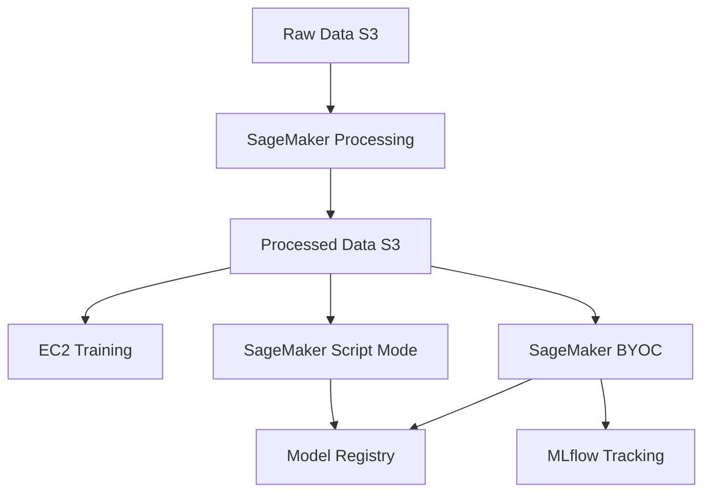

# Module 2: Medical Image Classification

## Overview

Learn to train medical image classification models, progressing from EC2 baseline to production SageMaker workflows with custom containers and experiment tracking.

## Learning Objectives

- Train baseline models on EC2
- Preprocess data with SageMaker Processing
- Use SageMaker Script Mode for managed training
- Build custom Docker containers (BYOC)
- Track experiments with MLflow

## Duration

2 hours

## Labs

1. **Data Preprocessing** (30 min) - SageMaker Processing jobs
2. **EC2 Baseline Training** (30 min) - Establish baseline performance
3. **SageMaker Script Mode** (30 min) - Managed PyTorch training
4. **Custom Containers** (30 min) - BYOC with full control
5. **Experiment Tracking** (30 min) - MLflow integration

## Architecture

## Model: DenseNet121

We'll use DenseNet121 for classification:
- **Parameters**: ~8M
- **Input**: 64x64 grayscale images
- **Output**: 6 classes
- **Training time**: ~10 minutes on ml.g5.xlarge
