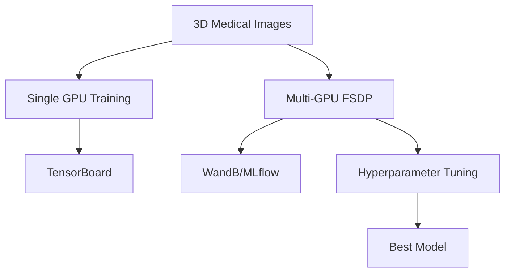

# Module 3: Medical Image Segmentation

## Overview

Scale to production-grade 3D medical image segmentation with MONAI, multi-GPU distributed training, and comprehensive experiment tracking.

## Learning Objectives

- Train 3D segmentation models with MONAI
- Implement distributed training (DDP and FSDP)
- Compare single-GPU vs multi-GPU performance
- Integrate experiment tracking tools
- Optimize hyperparameters at scale

## Duration

2 hours

## Labs

1. **Single GPU Training** (30 min) - SegResNet baseline
2. **Multi-GPU FSDP** (30 min) - Scale to 4 GPUs
3. **Experiment Tracking** (30 min) - WandB integration
4. **Hyperparameter Optimization** (30 min) - Automated tuning

## Architecture

## Models

| Model | Parameters | Memory | Use Case |
|-------|------------|--------|----------|
| SegResNet | ~5M | 2GB | Fast prototyping |
| UNet | ~31M | 8GB | Baseline |
| SwinUNETR | ~62M | 20GB | High accuracy |

## Training Strategies

### Single GPU
- **Instance**: ml.g5.xlarge (1 GPU)
- **Batch size**: 2-4
- **Training time**: ~30 min/epoch

### Multi-GPU FSDP
- **Instance**: ml.g5.12xlarge (4 GPUs)
- **Batch size**: 2 per GPU
- **Training time**: ~10 min/epoch
- **Speedup**: ~3x
